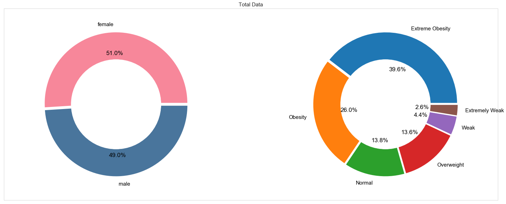
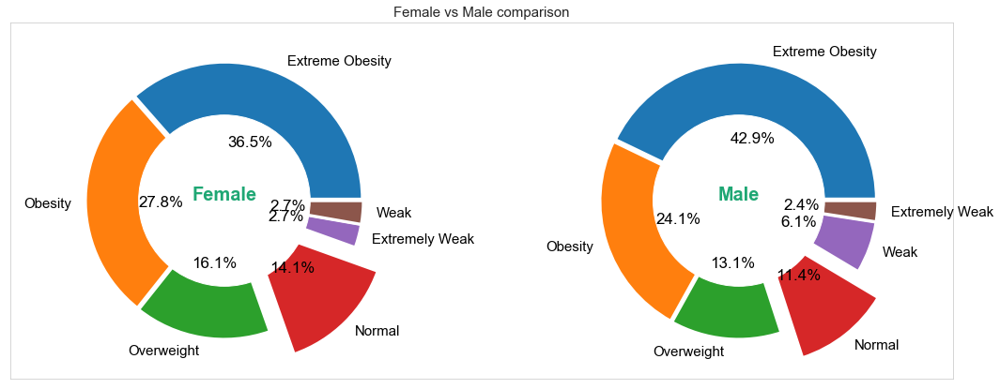
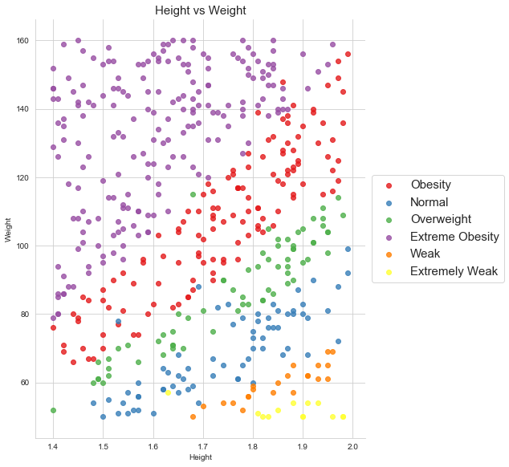

# 📊 BMI Prediction & Analysis

Exploratory Data Analysis on a 500-person dataset — visualizing BMI distribution, gender breakdowns, and health category classifications using Python.

---

## 🔍 About the Project

This project analyzes a dataset of **500 individuals** (male & female) to understand BMI distributions across different health categories. The goal was to practice data wrangling, visualization, and classification using real-world style data.

**BMI Categories used:**

| Index | Status |
|-------|--------|
| 0 | Extremely Weak |
| 1 | Weak |
| 2 | Normal |
| 3 | Overweight |
| 4 | Obesity |
| 5 | Extreme Obesity |

---

## 📁 Repository Structure

```
BMIPrediction/
│
├── 📓 notebooks/
│   └── BMI_predict.ipynb              # Main analysis notebook
│
├── 📊 data/
│   └── 500_Person_Gender_Height_Weight_Index.csv   # Dataset
│
├── 🖼️ images/
│   ├── bmi_histogram.png
│   ├── gender_bmi_overview.png
│   ├── female_male_bmi_comparison.png
│   └── height_vs_weight_scatter.png
│
├── 📄 README.md
└── 📄 requirements.txt
```

---

## 📊 Dataset

**File:** `data/500_Person_Gender_Height_Weight_Index.csv`

| Column | Description |
|--------|-------------|
| Gender | Male / Female |
| Height | Height in cm |
| Weight | Weight in kg |
| Index | BMI category (0–5) |

500 records · No missing values · Balanced gender split

---

## 📈 Key Findings

- Dataset is **gender-balanced**: ~51% Female, ~49% Male
- Most individuals fall in the **Extreme Obesity** category (39.6%)
- BMI distribution pattern is broadly **similar across genders**
- Height and weight show a clear **positive correlation**

---

## 📊 Visualizations

### Gender Split & Overall BMI Category Distribution


### Female vs Male BMI Category Comparison


### Height vs Weight (colored by BMI Status)


---

## 🛠️ Tech Stack

- **Python 3**
- **Pandas** — data loading & manipulation
- **Matplotlib** — histograms, pie charts, bar charts
- **Seaborn** — scatter plots
- **scikit-learn** — label encoding

---

## 🚀 How to Run

**1. Clone the repository**
```bash
git clone https://github.com/asgeek96/BMIPrediction.git
cd BMIPrediction
```

**2. Install dependencies**
```bash
pip install -r requirements.txt
```

**3. Launch the notebook**
```bash
jupyter notebook notebooks/BMI_predict.ipynb
```

> The notebook reads the dataset from `../data/500_Person_Gender_Height_Weight_Index.csv` — keep the folder structure intact.

---

## 👤 Author

**Anubhav Srivastava**  
[GitHub](https://github.com/asgeek96) · [LinkedIn](https://www.linkedin.com/in/asgeek)

---

## 📄 License

This project is open source and available under the [MIT License](LICENSE).
